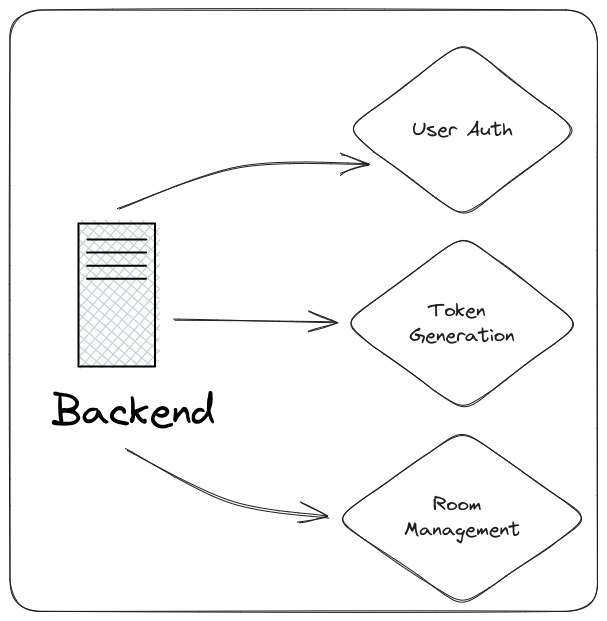

# Agora Virtual Space

The Agora Virtual Space is a demo of a web app wher users can sign up to join a 2D virtual space. Users can create a space or join existing ones. While in the 2D space, users get assigned a character that they can move around on the screen. When in close proximity of others users in that space, they can share voice & video other users in real-time.

> Here's a [live demo](https://agora-virtualspace.vercel.app/):


## Table of Contents
  * [Table of Contents](#table-of-contents)
  * [Getting Started](#getting-started)
    + [To run locally:](#to-run-locally)
  * [Features](#features)
  * [Project Structure](#project-structure)
    + [Frontend Components](#frontend-components)
  * [Diagrams](#diagrams)
    + [Architecture](#architecture)
    + [User Flow](#user-flow)
    + [Backend](#backend)
    + [Components](#components)
  * [Screenshots](#screenshots)
    + [Home](#home)
    + [Create Room](#create-room)
    + [View Rooms](#view-rooms)
    + [VirtualSpace](#virtualspace)
  * [Code Breakdown](#code-breakdown)
    + [High-level App](#high-level-app)
    + [Virtual Space Page](#virtual-space-page)
    + [Videos](#videos)
    + [Game](#game)
      - [Container](#container)
      - [Player](#player)
      - [RemoteSprite](#remotesprite)
    + [Audio/Video Chat](#audiovideo-chat)        
## Getting Started
### To run locally:

- Rename `.env.example` to `.env` and fill in the required details
- Execute `pnpm i` (if you don't hav pnpm install with `npm i -g pnpm`)
- Execute `pnpm run dev` to start a server on [localhost:3000](http://localhost:3000)

The tools we'll use for this projects:
- Agora RTC and RTM SDKs
- React
- Next.js
- React Three Fiber
- Prisma
- tRPC
- NextAuth (GitHub)

## Features

| **Feature** | **Description** |
| --- | --- |
| OAuth | Uses NextAuth for authentication |
| Space Management | Create and join rooms |
| Virtual Environment | A 2D environment that resembles an office or an event |
| User Avatar | A 2D avatar that the user can move around in the virtual space with the keyboard |
| Data Synchronisation | Sync locations across user |
| Animations | Animate the avatar with a sprite sheet |
| Voice Channel | Ability for users to communicate with each other over voice |
| Video Feeds | Display user videos |
| Agora Tokens | Expose an API to secure rooms  |
| Proximity Subscription | Ability to join a voice channel based on location proximity |
| User controls | Ability to mute/unmute local audio/video feeds |
| Mobile Support | Works on mobile devices using gesture handler |
| Deployment (CI/CD) | Deploy the frontend and backend online |

### OAuth
We're use Google OAuth to make signups easy, we store each user in a database along with their access/refresh tokens tied to their OAuth account. Only logged in user's are allowed to create and join spaces. On sign-up we also assign them unique IDs to use as Agora UIDs.
### Space Management
A signed-in user can create a virtual space, this equates to and Agora channel. We assign a channel ID to each space and store it in our database mapped to the user.
### Virtual Environment
We're creating a 2D virtual environment using a png sprite as the background - users can select a preferred map image for their space. This is drawn on the screen first behind all user interactions. We draw the user sprites on top of this layer. Finally, at the last layer we draw buttons and menus, things the user can click on. For example, muting and setting input devices for voice and video.
### User Avatar
A user is drawn as a _human_ sprite in the space. The sprite is redrawn every render cycle (~60 times a second) based on the user location as part of the application state.
### Data Synchronisation
We use the Agora RTM SDK to sync remote user locations. At every interval, all users in a space broadcast their location to the channel as an object with an x and y coordinate. The other users on receiving this message draw the remote sprite at that location interpolating between the previous location.
### Animations
We're using a spritesheet for animation, it's divided into sections for each animation like walking up, standing, walking left. Based on the difference of the current location from the previous location we assign a direction to the movement and user the direction to animate the user avatar.
### Voice Channel & Video Feeds
We're using the Agora RTC SDK to join a video channel, user's in the same space join the same channel and can subscribe to other users' audio and video.
### Agora Tokens
To secure our channels, we're using Agora Tokens - when a user joins a space, a request is made to our backend to generate a token for that space. This route can be protected or authorisation can be added to limit access. User's without a valid token cannot join the Agora channel.
### Proximity Subscription
After joining a space and subsequently an Agora channel. Based on the user location and any remote users in proximity we selectively subscribe to their audio/video feeds (if available). We check for proximity every render cycle.
### User controls
User's can control the character using the keyboard arrow keys, we attach event listeners for each keypress and modify the user location adding a speed vector to the direction pressed in the application state.
### Mobile Support
There's partial mobile support, user's can control their avatar by swiping along the screen but a lot of time wasn't spent to improve gestures.
### Deployment
The project contains a frontend, a backend server and a database that are all hosted on managed services.

## Project Structure
```
├── package.json
├── prisma
├── public
├── src
│   ├── agora-rtc-react.tsx
│   ├── components
│   ├── env
│   ├── pages
│   │   ├── api
│   │   ├── _app.tsx
│   │   ├── create.tsx
│   │   ├── game
│   │   │   └── [channel].tsx
│   │   ├── index.tsx
│   │   └── view.tsx
│   ├── server
│   ├── styles
│   ├── ui
│   └── utils
```
### Frontend Components
```
components
├── GameContainer.tsx
├── GameRelated
│   ├── Game.tsx
│   ├── Player.tsx
│   ├── RemoteSprite.tsx
│   └── Stage.tsx
├── RouteValidator.tsx
├── types.ts
├── utils.ts
└── VideoOverlay
    ├── AgoraHelpers.tsx
    ├── Buttons
    │   ├── AudioMuteButton.tsx
    │   ├── ButtonContainer.tsx
    │   └── VideoMuteButton.tsx
    ├── RemoteVideo.tsx
    └── Videos.tsx
```
## Diagrams
### Architecture

### User Flow

### Backend


### Components

## Screenshots
### Home

### Create Room


### View Rooms

### VirtualSpace


## Code Breakdown

### High-Level App
We're using Next.js to create our app. Each route exists as a file in the `pages` directory. 
We've implemented Auth using NextAuth.js. An authenticated user can create a room or view existing rooms. On room creation, we store the room to our database and list the rooms on the view screen. Rooms are where people can interact with one another. Each room is an isolated space:
```tsx
const Home: NextPage = () => {
  const { data, status } = useSession();

  if (status === "loading") {
    <Card text="loading..." />;
  }

  if (status === "unauthenticated") {
    return (
      <>
        <Head>
          <title>Agora Virtual Space</title>
        </Head>
        <div className="flex h-screen w-screen flex-col items-center justify-center bg-gray-100">
          <h1 className="my-10 text-5xl font-bold leading-none text-gray-700">
            Agora Virtual Space
          </h1>
          <div className="my-10">
            <SecondaryButton onClick={() => void signIn()}>Sign In</SecondaryButton>
          </div>
        </div>
      </>
    );
  }

  return (
    <>
      <div className="flex h-screen w-screen flex-col items-center justify-center bg-gray-100">
        <h1 className="my-10 text-5xl font-bold leading-none text-gray-700">Agora Virtual Space</h1>
        <div className="my-10 flex-col">
          <Link href={"/view"}>
            <PrimaryButton>View Rooms</PrimaryButton>
          </Link>
          <Link href={"/create"}>
            <PrimaryButton>Create Room</PrimaryButton>
          </Link>
        </div>
        <div className="my-10">
          <h3 className="m-2">Signed in as: {data?.user.name}</h3>
          <SecondaryButton onClick={() => void signOut()}>Sign Out</SecondaryButton>
        </div>
      </div>
    </>
  );
};
```

### Virtual Space Page
We're using React Three Fiber, which uses an HTML canvas and Three.js to render the virtual space. The user can see themself as a "human" sprite. All remote users are rendered with a "bird" sprite of different colors. Moving close to another user starts a video chat that is rendered on top of the 2D stage at the bottom of the screen. We're using the Agora RTM SDK to send and receive the positions of the users in the room: 

```tsx
<div className="h-screen w-screen bg-gray-100">
  <Videos
    playerPos={playerPos}
    localAudioTrack={tracks[0]}
    localVideoTrack={tracks[1]}
    remoteUsers={remoteUsers}
    localVideoMuteState={localVideoMuteState}
  />
  <Buttons
    localVideoMuteState={localVideoMuteState}
    setLocalVideoMuteState={setLocalVideoMuteState}
    localAudioTrack={tracks[0]}
    localVideoTrack={tracks[1]}
  />
  <Game
    setPlayerPos={setPlayerPos}
    remoteUsers={remoteUsers}
    playerPos={playerPos}
    character={character}
    stageName={stageName}
  />
</div>
```
### Videos
Renders videos at the bottom of the screen:
```tsx
<div className="absolute right-0 bottom-0 z-10 flex h-32 w-screen justify-center p-2">
  {Object.keys(remoteUsers).map((uid) => (
    <RemoteVideo key={uid} uid={uid} remoteUsers={remoteUsers} playerPos={playerPos} />
  ))}
  {!localVideoMuteState ? (
    <div className="mx-1 h-full w-24">
      <AgoraVideoPlayer
        className="h-24 w-24 overflow-hidden rounded-full"
        videoTrack={localVideoTrack}
      />
      <div className="m-1 rounded-full bg-white leading-tight opacity-60">
        <p className="m-auto w-20 justify-center self-center overflow-hidden text-ellipsis whitespace-nowrap align-middle text-sm">
          you
        </p>
      </div>
    </div>
  ) : (
    <MutedVideo name={"you"} />
  )}
</div>
```
### Game
The game component is the React Three Fiber canvas that houses the 2D space as well as character rendering and logic:
#### Container
Composes the different components we need to render on-screen:
```tsx
<>
  <Canvas {...bind()} style={{touchAction: 'none'}}>
    <KeyboardControls map={keyMap}>
      <Stage stageName={stageName} />
      <Player setPlayerPos={setPlayerPos} character={character} />
      {Object.keys(remoteUsers).map((u) => (
        <RemoteSprite
          playerPos={playerPos}
          position={(remoteUsers[parseInt(u)] as userPosition).position}
          key={u}
          uid={parseInt(u)}
        />
      ))}
    </KeyboardControls>
  </Canvas>
</>
```
#### Player
The local user is rendered by this component and it handles the user controls:
```tsx
export const Player = (props: {
  setPlayerPos: Dispatch<SetStateAction<Vector3>>;
  character: customSpriteConfig;
}) => {
  const ref = useRef<Sprite>(null);
  const { setPlayerPos, character } = props;
  const [spriteState, setSpriteState] = useState(character.left);
  const texture = useAnimatedSprite(ref as MutableRefObject<Sprite>, spriteState);
  const frustum = useRef(new Frustum());
  const boundsMatrix = useRef(new Matrix4());
  const counter = useRef(0);
  const [, get] = useKeyboardControls<Controls>();

  useFrame((s, dl) => {
    if (!ref.current) return;
    // handle user controls
    if (dragRef[0] || dragRef[1]) {
      handleMouse(setSpriteState, character);
    } else {
      const keyState = get();
      handleKeyboard(keyState, setSpriteState, character);
      if (keyState.jump) {
        // reset position on jump
        ref.current.position.set(0, 0, 0);
      }
    }
    // handle out of bounds
    boundsMatrix.current.multiplyMatrices(s.camera.projectionMatrix, s.camera.matrixWorldInverse);
    frustum.current.setFromProjectionMatrix(boundsMatrix.current);
    if (!frustum.current.containsPoint(ref.current.position)) {
      ref.current.position.lerp(new Vector3(0, 0, 0), 0.1);
      setPlayerPos(ref.current.position);
    } else {
      ref.current.position.addScaledVector(_velocity, character.speed * dl);
      ref.current.position.z = 1;
      setPlayerPos(ref.current.position);
    }
    // throttle
    const time = s.clock.getElapsedTime();
    const factor = 10;
    if (Math.round(time * factor) / factor > counter.current) {
      sendPositionRTM(ref.current.position);
      counter.current = Math.round(time * factor) / factor;
    }
  });

  return (
    <sprite ref={ref} scale={character.charSize}>
      <spriteMaterial map={texture} />
      <Text scale={[0.36, 0.18, 1]} anchorY={3} outlineWidth={0.04}>
        You
      </Text>
    </sprite>
  );
};
```
#### RemoteSprite
The remote user is rendered as a remote sprite:
```tsx
export const RemoteSprite = (props: { position: Vector3; playerPos: Vector3; uid: number }) => {
  const spriteRef = useRef<Sprite>(null);
  const circleRef = useRef<Sprite>(null);
  const randomPetRef = useRef(getRandomPet());
  const spriteConfigPet = randomPetRef.current;
  const [sprite, setSprite] = useState(spriteConfigPet.stand);
  const texture = useAnimatedSprite(spriteRef as MutableRefObject<Sprite>, sprite);
  const { position, playerPos, uid } = props;
  const { data } = api.main.getUserName.useQuery({ agoraId: uid });

  useFrame(() => {
    const remotePos = spriteRef.current?.position;
    const agoraUser = AgoraDict[uid];
    if (remotePos) {
      remotePos.lerp(position, 0.5);
      circleRef.current?.position.set(position.x, position.y, position.z - 0.2);
      // spritesheet logic
      handleSprite(setSprite, position, remotePos, spriteConfigPet);
      if (agoraUser) {
        // subscription logic
        handleSubscription(remotePos, playerPos, agoraUser);
      } else {
        console.warn("no user", agoraUser, AgoraDict);
      }
    }
  });

  return (
    <>
      <Circle
        scale={distanceToUnsubscribe * 1.2}
        ref={circleRef}
        position={new Vector3(0, -0.2, 0.1)}
        material={remoteSpriteCircleShader}
      />
      <sprite ref={spriteRef} scale={spriteConfigPet.charSize}>
        <spriteMaterial map={texture} />
        <Text scale={0.18} anchorY={2.6} outlineWidth={0.04}>
          {data?.name ? data.name?.split(" ")[0] : '...'}
        </Text>
      </sprite>
    </>
  );
};

function handleSubscription(remotePos: Vector3, playerPos: Vector3, agoraUser: agoraUserType) {
  if (remotePos.distanceTo(playerPos) > distanceToUnsubscribe &&
    agoraUser.isSubscribedAudio) {
    void rtcClient
      .unsubscribe(agoraUser.agoraUser, "audio")
      .then(() => (agoraUser.isSubscribedAudio = false))
      .catch(console.log);
  }
  ...
}

```
### Audio/Video Chat
We're using the Agora RTC SDK for audio and video chat. On joining a room, we join an Agora RTC and RTM channel. When a user is close to another user, we selectively subscribe to their available audio/video.
We've created a React wrapper for the Agora Web SDK, which is used as follows:

```tsx
export const rtmChannel = rtmClient.createChannel(window.location.pathname.slice("/game/".length));
export const rtcClient = AgoraRTC.createClient({ mode: "rtc", codec: "vp8" });
...
function GameContainer(props: GameProps) {
  const { isSuccess: ready, data: tracks, error } = useMicrophoneAndCameraTracks("usetrack");

  useEffect(() => {
    async function init() {
      // RTC
      if (ready && tracks) {
        try {
          rtcClient.on("user-joined", (user) => {
            AgoraDict[user.uid as number] = {
              agoraUser: user,
              isSubscribedVideo: false,
              isSubscribedAudio: false,
            };
          });
          rtcClient.on("user-left", (user) => {
            setRemoteUsers((ps) => {
              const copy = { ...ps };
              delete copy[user.uid as number];
              return copy;
            });
            delete AgoraDict[user.uid as number];
          });
          await rtcClient.join(appId, channel, rtcToken, agoraId);
          await rtcClient.publish(tracks).catch((e) => {
            console.log(e);
          });
        } catch (e) {
          console.log("!", e);
        }
        // RTM
        try {
          rtmChannel.on("ChannelMessage", (message, uid) =>
            handleChannelMessage(message, uid, setRemoteUsers)
          );
          await rtmClient.login({ uid: String(agoraId), token: rtmToken });
          await rtmChannel.join();
        } catch (e) {
          console.log(e);
        }
        console.log(`joined RTM: ${agoraId} ${rtmChannel.channelId}`);
      }
    }
    void init();

    return () => {
      const func = () => {
        void sendPositionRTM(new Vector3(1000, 1000, 100));
        rtmChannel.removeAllListeners();
        rtcClient.removeAllListeners();
        setRemoteUsers({});
        AgoraDict = {};
      };
      try {
        void func();
      } catch (e) {
        console.log(e);
      }
    };
  }, [ready]);
  ...
```

